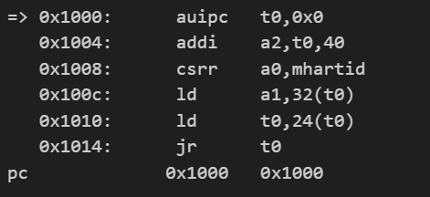
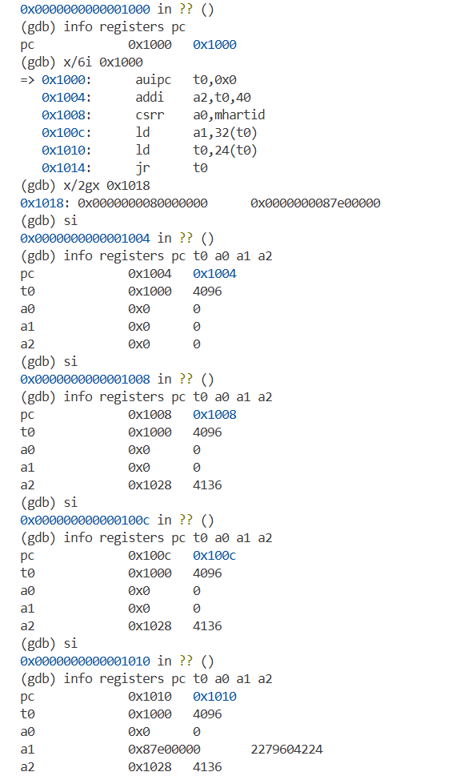
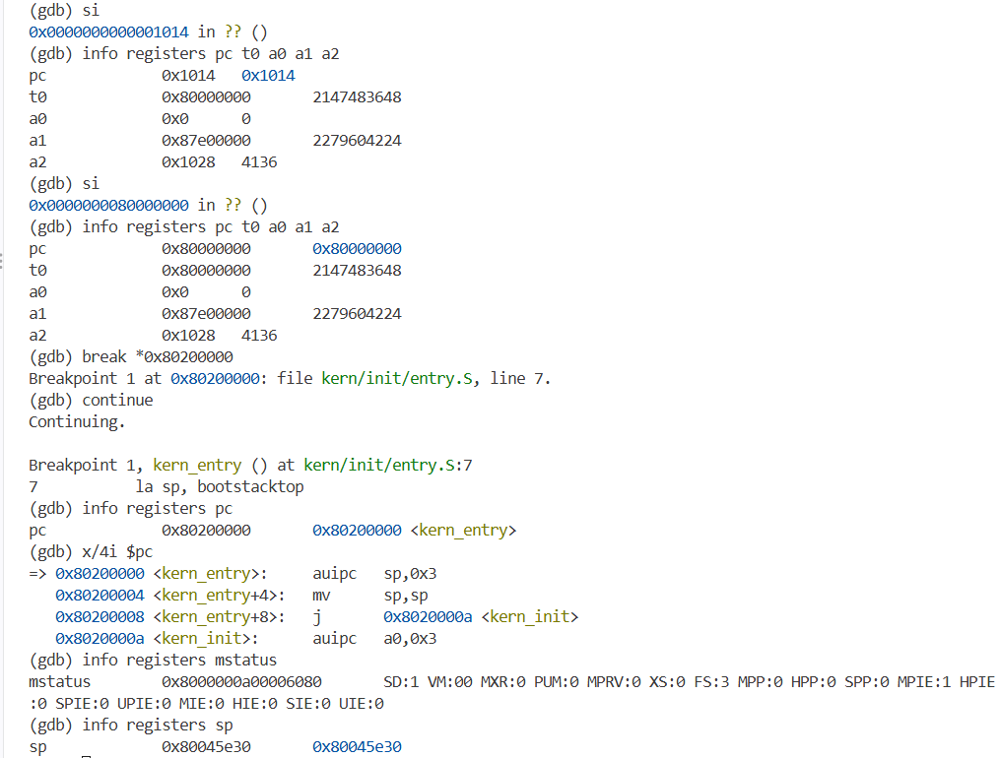
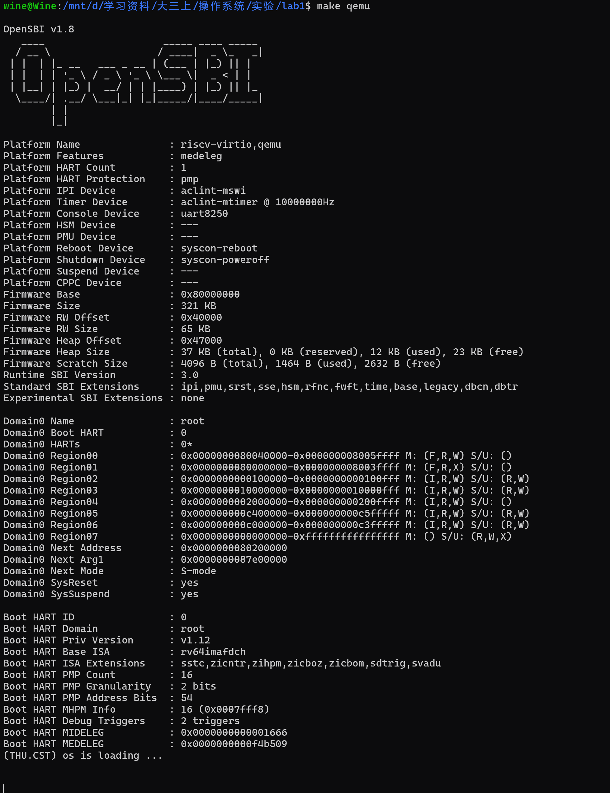

# 操作系统实验报告

## 实验基本信息

| 项目 | 内容 |
| --- | --- |
| **实验名称** | Lab 1: 最小可执行内核 |
| **小组成员** | 2413094-卢思齐、2414113-焦程远、2411617-陈彦冰 |
| **完成日期** | 2026-10-07 |

### 小组分工

| 成员 | 负责的练习/模块 |
| --- | --- |
| 2413094-卢思齐 | 练习一 |
| 2414113-焦程远 | 练习二 |
| 2411617-陈彦冰 | 练习二 |

***

## 一、实验目的

本实验的主要目的是：

1. 了解 Qemu 模拟器的启动流程，以及程序内存布局和编译流程相关知识
2. 学会使用链接脚本描述内存布局，亲身体会如何进行交叉编译生成可执行文件，进而生成内核镜像
3. 能够使用 OpenSBI 作为 bootloader 加载内核镜像，并使用 Qemu 进行模拟
4. 能够使用 OpenSBI 提供的服务，在屏幕上格式化打印字符串用于以后调试

***

## 二、实验内容与实现

### 练习1：理解内核启动中的程序入口操作

负责人：2413094-卢思齐

**操作：**

```c
// entry.S
    la sp, bootstacktop
```

`la`是伪指令，把符号 `bootstacktop` 的地址装入栈指针寄存器 sp。

`bootstacktop` 是 `entry.S` 中 `bootstack`（大小` KSTACKSIZE`，即 2 页 = 8KB）之后的位置，也就是内核栈的栈顶。

**目的：**

为 C 函数调用准备栈空间。

栈从高地址向低地址增长，`sp `必须指向栈顶，这样` kern_init` 及其内部函数调用才能保存返回地址、传递参数、使用局部变量。

**操作：**

```c
// entry.S
    tail kern_init
```

`tail` 是一条伪指令，等价于「取 `kern_init` 的地址并直接跳转过去」，不保存返回地址。

**目的：**

把 CPU 控制权交给 C 语言编写的` kern_init`，开始执行C语言的内核初始化代码。

因为 `kern_init` 最后是`while(1)` 死循环、永不返回，所以用 `tail`（跳转）而不是 `call`（调用）更合适，省去无意义的返回地址保存。

***

### 练习2:  使用GDB验证启动流程

**负责人：** 2414113-焦程远、2411617-陈彦冰

**RISC-V 硬件加电后最初执行的几条指令位于什么地址？**

回答：在复位地址 0x1000 处，具体可见调试结果截图。



**它们主要完成了哪些功能？**

回答：它们做了最基本硬件初始化，然后把控制权交给了 OpenSBI（跳转到 0x80000000）。

***

## 三、测试与验证

**测试截图：**

- 编译及运行成功的输出





- 测试结果



***

## 四、实验总结与收获

### 对操作系统的理解

| 本实验知识点 | 对应 OS 原理 | 关系与差异 |
| --- | --- | --- |
| 链接脚本与加载地址 0x80200000 | 程序装载、地址空间布局 | 链接期确定代码/数据虚拟布局，OS 负责装载与重定位 |
| 内核栈设置（bootstack） | 进程/线程运行环境、栈帧 | 内核也需要自己的运行栈，属“运行上下文”概念 |
| OpenSBI 与 ecall | 固件与系统调用机制 | SBI 类似“给操作系统的系统调用”，运行在 M 态 |
| 格式化输出 cprintf | 设备抽象、字符设备驱动 | 控制台是字符设备，驱动分层：printf→console→SBI |
| BSS 段清零 | 进程内存初始化 | .bss 不占文件空间，装载后由 OS/运行时清零 |
| 死循环驻留 | 内核主循环/idle 进程雏形 | 后续实验将由调度器与 idle 循环取代 |

### AI 协作开发的经验

虽然lab1只是操作系统实验课程的起步，但我们也开始逐步探索如何更好、更准确、更高效地与AI交流并开发项目。不管是之前使用AI的体验还是这次摸索QEMU启动，我们都能感受到AI在环境配置和排查底层报错时非常高效，它降低了试错成本，省去了大量翻看文档的时间。但我们必须随时根据实际情况调整指令来适应新情况，最终的理解和决策还得靠我们自己动手。AI只是一位“随时在线的助教”，负责提供思路和线索。这次协作让我们学会了如何在借助AI提高效率的同时，尽可能让自己保持独立排查问题的能力。

***
